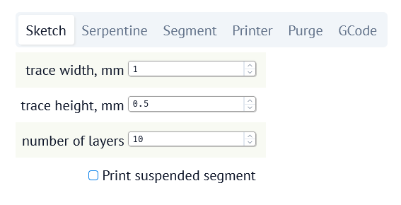
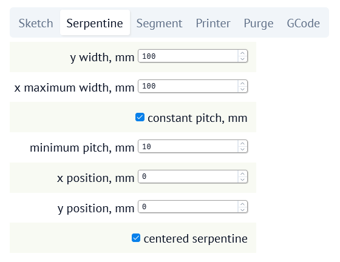
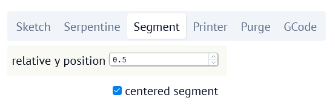
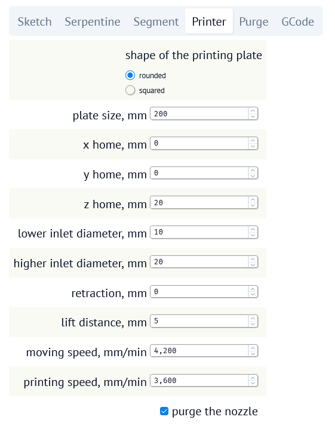
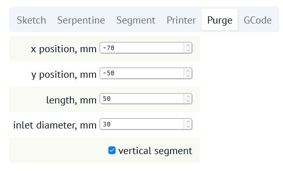
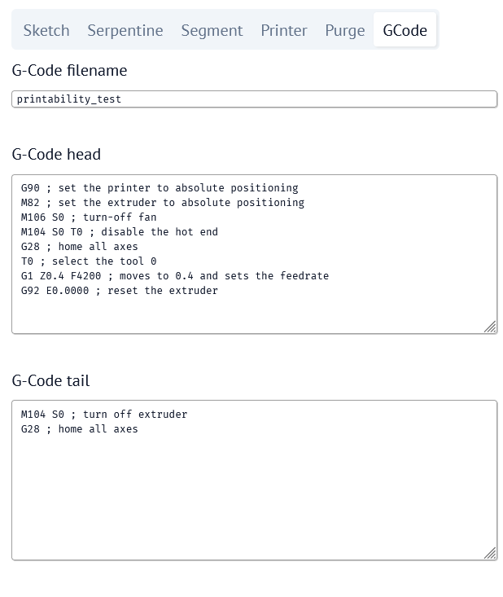
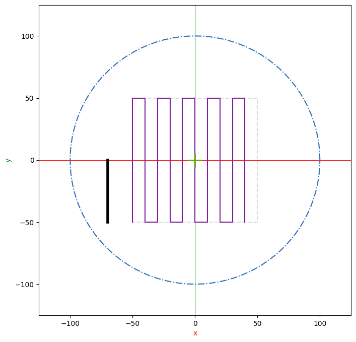

# G-Code generator

[](https://www.gnu.org/licenses/gpl-3.0)
## Summary
G-Code generator is an application intended to generate a g-code file to test and optimize the performance of direct ink writing (DIW) 3D printers. The g-code generated by the software will contain a 3D testing shape, useful to:
- calibrate the printing parameters (e.g., inlet diameter, printing speed)
- optimize the ink formulation (depending on the printing results)

Once generated a g-code with the desired settings, the file must be printed, and the geometric features of the obtained shape must be analyzed. The mismatch of the printed shape with the designed one will give useful information to correct the printing parameters or to reformulate the ink.  
The software is distributed *'as is'*, and no responsibily is taken from possible damage to the printer caused by its misuse.  
The software is licenced under under the terms of the GNU GPLv3. 

If you use it in your scientific research, please cite:
_Luzzi, E., de Salzano de Luna, M., Caputo, D., Filippone, G., & Aprea, P. (2025). Printability Metrics in Direct Ink Writing: Critical Review of the Literature and Novel Perspective Based on Dimensional Analysis. Advanced Materials Technologies, e01282 (https://doi.org/10.1002/admt.202501282)_

## Installation
### Prerequisites
1. Python >=3.13
2. uv package
### Installation procedure
1. If uv is not already installed:
    ```pip install uv```
2. Download the .zip file and unpack it in a folder of your choice
3. cd into the unzipped folder
4. Synchronize the package:
    ```uv sync```
This will initialize a virtual environment and download/install the required python packages 'matplotlib' and 'marimo', together with their dependencies
## Usage
The easiest way to start the g-code generator is to launch the 'start' script.
>under windows:  
`start.bat`  

>under linux:  
`start.sh`  
>remember to make it executable:  
`chmod +x start.sh`  

Once started, the application will automatically open a web page pointing at [http://127.0.0.1:2718](http://127.0.0.1:2718). This will display the settings panel, and you will be ready to go.  
The main purpose of the g-code file generated by 'gcode-generator' is to print a testing 3D shape to calibrate the printer settings and/or the ink formulation. To work with the easiest shape and the less possible parameters to adjust, the testing shape will be a sequence of squared serpentines stacked on top of each other.  
Optionally, it is possible to print a suspended segment, to measure the bending of the ink.
The web interface of 'gcode-generator' will show the top view of the testing shape to be printed, and will react in real time to every settings change.  
The objects that will compose the testing 3D shape are:
1. a **squared serpentine**, that can have:
    - `constant pitch` (the distance between adjacent vertical segments will be kept constant. This is useful to calibrate printer settings such as printing speed or the inlet diameter of the extruder)
    - `decreasing pitch` (the distance between adjacent vertical segments will decrease until it reaches a set value. This is useful to optimize the ink formulation)  
The software will genereate the serpentine 
2. a **suspended segment** (optional), that will be printed on top of the stacked serpentines. The suspended segment will be traced horizontally. Its position along the y axis can be adjusted (e.g., it can be printed closer to the bottom or top edge of the serpentine, or in the middle).
3. Before printing the 3D testing shape, the printer nozzle can also be purged by printing an **extra segment** aside.  

To properly calibrate the printer, a correct value of the 'inlet diameter' must be found. Ideally, as in the FDM printers, the material to be printed is fed to the extruder and exits a nozzle. The ratio between the inlet section and the section of the trace to print determines the right amount of material to extrude.  
An easy way to find the correct value of the inlet diameter is to set a lower and upper limit for this value (`lower inlet diameter` and `higher inlet diameter`, respectively): in this case, the serpentine will be printed by increasing the inlet value for each segment. By measuring the printed width of the segments and comparing with the value set in gcode_generator it will be possible to find the correct inlet diameter value.  
The software can adapt to cartesian or delta printers. Accordingly, is possible do set the shape of the printing plate as `squared` or `rounded`.
## Interface
The interface of the g-code generator is divided into two sections:
- left: settings panel
- right: graphic representation of the trace to be printed and some geometrical information
### Settings
The settings panel is tabbed to easily find the parameters to set. The panel sequence is:
- [Sketch](#sketch)
- [Serpentine](#serpentine)
- [Segment](#segment)
- [Printer](#printer)
- [Purge](#purge)
- [G-Code](#g-code)
#### Sketch

This sections allows to set:
- the `trace width` of the printed trace
    - suggested value: around 1.2 - 1.3 times the diameter of the printer nozzle
- the `trace height` of the printed trace
    - suggested value: about one half the diameter of the printer nozzle
- the `number of layers`
    - suggested value: 10
- the possibility to print a `suspended segment` on top of the stacked serpentines
#### Serpentine

This section allows to set:
- the `y width` of the serpentine, i.e., the width along the y axis
- the `x maximum width` of the serpentine, i.e., the maximum width along the x axis
- if the serpentine must have a `constant pitch` or a decreasing one
- the `minimum pitch` of the serpentine. If `constant pitch` is selected, this  will be the pitch of the serpentine
- the `x position`, i.e., the starting printing position along the x axis
    >**IMPORTANT**: if `centered serpentine` is selected, this value will be ignored
- the `y position`, i.e., the starting printing position along the y axis
    >**IMPORTANT**: if `centered serpentine` is selected, this value will be ignored
- if it must be a `centered serpentine`: if so, the serpentine area, intended as a rectangle of 'x maximum width'*'y width' area, will be centered in the printing plate
#### Segment

This section allows to set:
- the `relative y position` of the segment, i.e., the y coordinate of the segment expressed as fraction of the serpentine y width
    > **IMPORTANT**: if `centered segment` is selected, this value will be ignored
- if it must be a `centered segment`: if so, the segment will be printed in the middle of the serpentine
#### Printer

This section allows to set:
- the `shape` of the printing plate: it can be ***'rounded'*** for delta printers or ***'squared'*** for cartesian ones
- the `plate size`: depending on the printing plate shape, this value will be intended as the edge of the square or the diameter of the circle
- the `x home`, `y home`, `z home` of the printer
    >**IMPORTANT**: on a `rounded` printing plate the default home is in the center of the circle, whereas on a `squared` printing plate it is in the lower left vertix
- the `lower inlet diameter` and `higher inlet diameter` values
- the `retraction` amount, defined as the mm of ink to retract in the nozzle after printing a continuous trace
- the `lift distance`, intended as the vertical shift of the nozzle in mm between printing different traces
- the `moving speed` of the nozzle, i.e., its translational speed when not printing
- the `printing speed` of the nozzle, i.e., its translational speed when printing
- if the printer should `purge the nozzle` before starting to print
#### Purge

This section allows to set:
- the `x position` and `y position` of the purge segment to be printed
- the `length` of the purge segment
- the `inlet diameter` of the purge segment
    - suggestion: it should be a pretty high value, to make the printer to extrude a lot of material
- if the purge trace must be a `vertical segment`
#### G-Code

This section allows to set:
- the `G-Code filename`
- the `G-Code head`, the instructions to prepend to the g-code
- the `G-Code tail`, the instructions to postpend to the g-code
## Information area
On the right side of the web page there is a tabbed panel, composed of:
- `Plot`: a plot area showing the top view of the 3D testing shape
- `Serpentine info`: a table showing, for each vertical segment of the serpentine, the x position, inlet diameter and pitch (distance from previous segment)
### Plot area

In the `Plot` area a chart shows:
- the printing plate perimeter (blue dash-dot line)
- che home position of the nozzle (green cross)
- the maximum area of the serpentine (gray dash-dot line)
- the serpentine to be printed (purple line)
- the segment to be printed, if `print suspended segment` is selected (purple line)
- the purge segment to be printed, if `purge the nozzle` is selected (black fat line)
### Commands area
On the right of the web page there are three buttons:
- `SAVE G-CODE FILE`: to save the g-code. The file will be saved as `filename`.gcode
- `SAVE SERPENTINE INFO`: to save the table showed in the `Serpentine info` area, useful to compare the geometrical features of the printed shape with those of the designed one. The file will be saved as `filename`_serpentine_info.csv
- `SAVE SETTINGS FILE`: to save the updated settings, otherwise on the next start the default values will be reloaded
## Use cases
In the following, two procedures will be described intended to fullfil the most common needs ecountered when printing custom inks with a DIW printer.
### Printer calibration
This procedure is suggested to properly calibrate the printer.  
The quality of a printed shape depends, among the other things, on some device-related parameters, like the translational speed of the nozzle when it is extruding material (`printing speed`) and the inlet diameter defined above.  
If you have a commercial printer, the inlet diameter value has already been set in the printer profile factory file. In this case, no further optimization should be needed. You may still want to use this procedure to calibrate the printing speed. If so, you have to inspect the printer profile file (or ask the printer manufacturer) and insert the inlet diameter value in both the `lower inlet diameter` and `higher inlet diameter` boxes.  
If, instead, you have a custom, home-made printer, this procedure is crucial to find the right `inlet diameter` value.  
To calibrate the printer:
1. Prepare a *'standard'* ink that is easily printable, not too elastic, with known properties and load it in the printer
2. Open 'gcode_generator' and insert the following settings (not mentioned settings are freely adjustable):
    - [Sketch](#sketch)
        - `trace width`, `trace height`: set it depending on your nozzle diameter
        - `number of layers`: 1
        - `print suspended segment`: no
    - [Serpentine](#serpentine):
        - `constant pitch`: yes
        - `minimum pitch`: ten time the trace width
    - [Printer](#printer):
        - `shape`, `size`: it depends on your printer
        - `lower inlet diameter`, `higher inlet diameter`: insert two reasonable values (i.e., from 5 to 10 times the nozzle diameter)
        - `printing speed`: again, insert a reasonable value
            > you can adjust it later if experiencing printing problems
3. save both the g-code file and the serpentine info file
4. print the testing shape with your printer and the prepared ink
5. inspect the printed trace to ensure an even printing
    >ripples or discontinuous segments could suggest to adjust the `printing speed` value and repeat the test
6. if everything is ok, shoot a top view picture framing the printed shape and a ruler
7. measure the width of the vertical segments of the serpentine with the software of your choice (but ImageJ could be a good one)
    >a good practice would be to measure from 5 to 7 times along each vertical segment, and averaging the measures
8. compare the measured width of each segment with the `trace width` value
9. if the `inlet diameter` range has been chosen correctly, you should see that the first segments have been *overexstruded*, and their width is higher than the designed one. On the contrary, the last segments should have been *underextruded*, i.e., their width is lower than the designed one 
    >If you find that all the segments are under- or over-extruded, you should adjust the `inlet diameter` range and repeat the test 
10. once the range has been correctly set, the segment with the width most close to the designed one will give the right `inlet diameter` to insert in the gcode_generator from now on.

### Ink optimization
This procedure is useful when preparing custom inks. The quality of a printed shape depends on rheologial features of the paste, and can be assessed by doing an image analysis on the 3D testing shape.  
This procedure should follow the [Printer calibration](#printer-calibration) one, especially if you have a custom, home-made printer.
1. Prepare the ink to be tested and load it in the printer
2. Open 'gcode_generator' and use the following settings (not mentioned settings are freely adjustable):
    - [Sketch](#sketch)
        - `layer with`, `layer height`: set it depending on your nozzle diameter
        - `number of layers`: 10 (this is the value suggested for standard tests)
        - `print suspended segment`: yes
    - [Serpentine](#serpentine)
        - `constant pitch`: no
        - `minimum pitch`: the value of the `trace width`
    - [Printer](#printer)
        - `shape`, `size`: set it depending on your printer
        - `lower inlet diameter`, `higher inlet diameter`: insert the value you found from the [Printer calibration](#printer-calibration) procedure
        - `printing speed`: use the same value set (or optimized) in the [Printer calibration](#printer-calibration) procedure
3. save the g-code file and the serpentine info file
4. print the testing shape with your printer and the prepared ink
5. get a top view picture framing the printed shape and a ruler
6. perfom the geometric assessment described [here](https://doi.org/10.1002/admt.202501282)
7. optimize the ink formulation according to the suggestion reported [here](https://doi.org/10.1002/admt.202501282)
